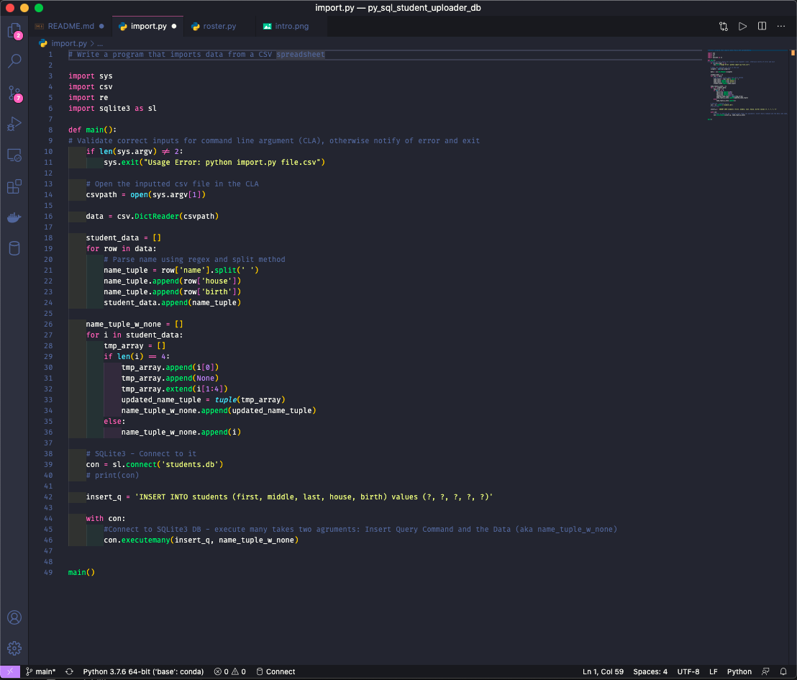
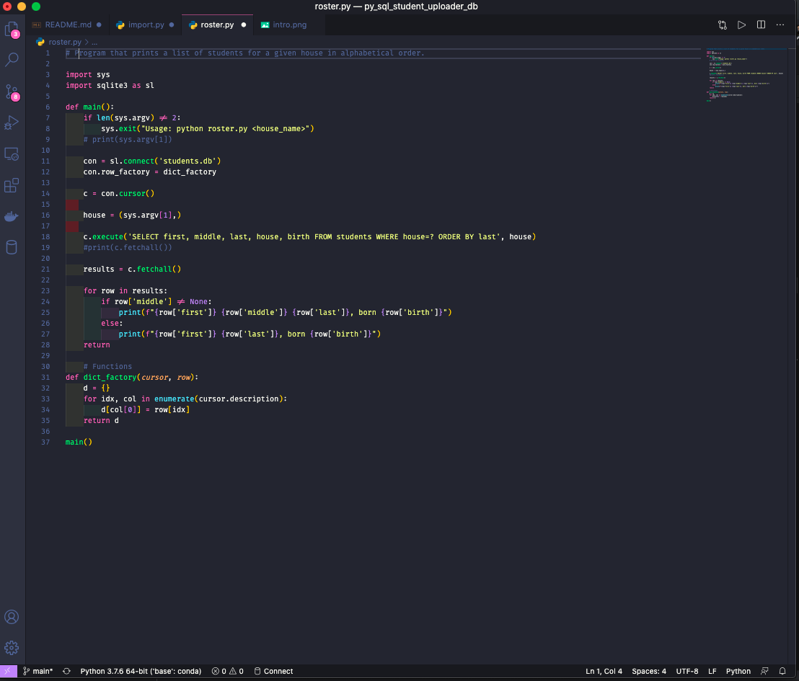

# Upload All Student Data From CSV into SQL DB, Output Rosters

## Scope & Purpose | Main Built-in Functionalities

* Implemented a program to import student data into a database, and then produce class rosters. For years, the professors have been maintaing a CSV file containing all of the students’ names and houses and years. But that file didn’t make it particularly easy to get access to certain data, such as a roster of all the students, or an alphabetical listing of the students enrolled at the school.

## System Prerequisites To Get Started

You will need the following installed on your computer system and import the following libraries:
* Python 3.7+

Libraries / Packages
* Regular Expressions
* Systems
* CSV
* SQLite3

## Getting Started

* Download the repository
* Run in the terminal

## Code Review - Recruiters / Hiring Managers

Notes: import.py

    The rogram accepts the name of a CSV file as a command-line argument.

    If the incorrect number of command-line arguments are provided, the program will print an error and exit.

    The CSV file will exist, and will have columns name, house, and birth. For each student in the CSV file, I inserted the student into the students table in the students.db database.

    The database have separate columns for first, middle, and last names.

    I first parse each name and separate it into first, middle, and last names.

    Assumptions: each person’s name field will contain either two space-separated names (a first and last name) or three space-separated names (a first, middle, and last name).

    Students without a middle nam will be NULL in the table.

    

Notes: roster.py

    This program accepts the name of a house as a command-line argument.

    If the incorrect number of command-line arguments are provided, the program prints an error and exit.

    The program will query the students table in the students.db database for all of the students in the specified house. It will then print out each student’s full name and birth year (formatted as, e.g., Harry James Potter, born 1980 or Luna Lovegood, born 1981).

    Students results are ordered by last name. For students with the same last name, will be ordered by first name.

    

### Personal Note

* Hope you enjoyed it. Thank you for your time!

## Author

* **Johneson Giang** - *Invidual Project* - [Github](https://github.com/jhustles)

## License

This project is licensed under the MIT License - see the [LICENSE.md](LICENSE.md) file for details

## Acknowledgments & Credits

* Shout out to David J. Mahlan & Brian Yu

